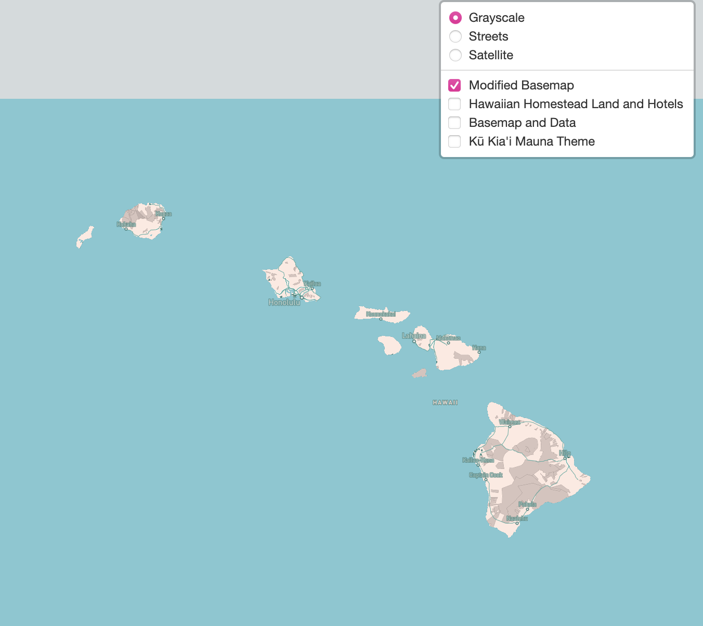

# Hawaii Landuse on the Hawaiian Islands:

This project is inspired by the distribution of land on the Hawaiian Islands. There is no argument that tourism is a strong influencer and contributor to the Hawaiian Islands. I would like to point out and draw attention to the idea of preservation and respect to the locals of the islands. The maps below visualize Hawaiian Homesteads and hotels across all islands. Hawaiian Homesteads are government reserved lands for Native Hawaiians and their families. I chose hotels to represent tourism because with hotels usually come other commercialized activities and entertainment.

This topic is important to open discussion about land preservation for local people. The price of living in Hawai’i is one of the highest in the United States. This influx is obviously caused by the high tourism and reliance of imports.

## Tile 1 Screenshot: Modified Basemap
The first abselay is inspired by the tropical palette of the islands. Bright colors and blues represent the easy-going energy.

Zoom restrictions: 2-12
