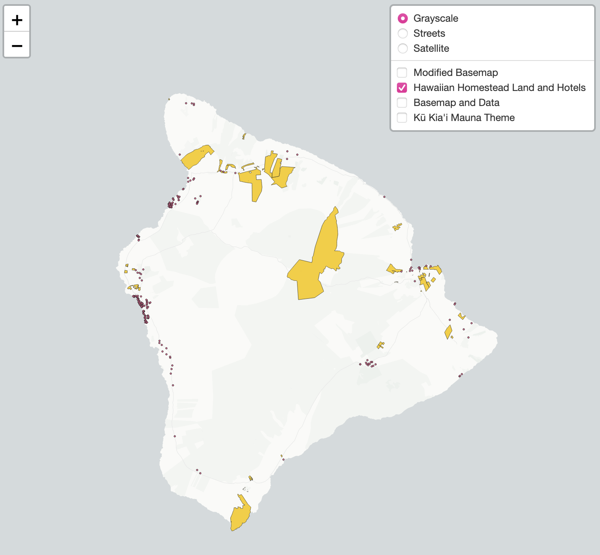

# Hawai'i Landuse on the Hawaiian Islands:

<a href="https://nicolealorenzo.github.io/hawaii_landuse_nicolelorenzo/Index.html
">Access the Interactive Map Here</a>

This project is inspired by the distribution of land on the Hawaiian Islands. There is no argument that tourism is a strong influencer and contributor to the Hawaiian Islands. I would like to point out and draw attention to the idea of preservation and respect to the locals of the islands. The maps below visualize Hawaiian Homesteads and hotels across all islands. Hawaiian Homesteads are government reserved lands for Native Hawaiians and their families. I chose hotels to represent tourism because with hotels usually come other commercialized activities and entertainment.

This topic is important to open discussion about land preservation for local communities. The price of living in Hawai’i is one of the highest in the United States. This influx is obviously caused by the high tourism and reliance of imports.

Area of focus: All the the maps below showcase the Hawaiian Islands. Zoom is availabl for each individaul island to highlight different scales and features, like roads and national parklands.

## Tile 1 Screenshot: Modified Basemap
The first baselayer is inspired by the tropical palette of the islands. Bright colors and blues represent the easy-going energy.
Zoom restrictions: 2-12

Zoomed map of O'ahu (tile map 1):

## Tile 2 Screenshot: Hotel and Hawaiian Homestead Data
This second map visualizes the Hotels and Hawaiian Homestead areas. The points represent each hotel, and the polygons represent the Hawaiian Homesteads. As you can see, many of the hotels are near the coasts. Pay attention to how small the Hawaiian Homestead areas are. This has caused a rise of issues like growth in local population, increase of the tourism industry, and preservation of land and agricultural land.

Zoom restrictions: 2-12

Zoomed map of the Big Island (tile map 2):

## Tile 3 Screenshot: Basemap and Data
This third map combines the custom basemap and the landuse data layer.
Zoom restriction: 2-12

## Tile 4 Screenshot: Kū Kia'i Mauna Inspired Basemap
"Guard over the Mountain"
This forth basemap is inspired by the Kū Kia'i Mauna movement. On the Big Island of Hawai’i the government is planning to build a thirty meter telescope on the sacred land of Mauna Kea. Out of cultural respect for the Native Hawaiian communities, this issue has been ongoing. A worldwide movement has been sparked. It’s important to acknowledge the cultural and land of places that are often commercialized and appropriated.

